# Лабораторная Работа №3. Разработка многопоточного приложения в ОС Windows
## Цель работы
Знакомство с многопоточным программированием и методами синхронизации потоков средствами Windows API.

## Задание
1. Вычислить номер варианта задания как остаток от деления **суммы** порядкового номера студента по списку в журнале на количество вариантов заданий. Если остаток равен нулю, выбрать последнее задание.  
**Nвар = Nв_списке mod K**,  
где Nвар - искомый номер варианта, Nв_списке - порядковый номер студента по списку в журнале, K - количество вариантов заданий на данную лабораторную работу.
2. Выбрать граф запуска потоков в соответствии с вариантом задания. Вершины графа являются точками запуска/завершения потоков, дугами обозначены сами потоки, длину дуги следует интерпретировать как ориентировочное время выполнения потока.
3. Реализовать последовательно-параллельный запуск потоков в ОС Windows с использованием средств Windows API для запуска и синхронизации потоков. Запрещается использовать какие-либо библиотеки и модули, решающие задачу кроссплатформенной разработки многопоточных приложений (std::thread, Qt Thread, Boost Thread и т.п.). Для этого необходимо написать код в файле `lab3.cpp`:
    1. Функция `unsigned int lab3_task_number()` должна возвращать номер варианта, полученный на шаге 1.
    2. Функция `int lab3_init()` заменяет собой функцию `main()`. В ней необходимо реализовать запуск потоков, инициализацию вспомогательных переменных (мьютексов, семафоров и т.п.). Перед выходом из функции `lab3_init()` необходимо убедиться, что все запущенные потоки завершились. Возвращаемое значение: `0` - работа функции завершилась успешно, любое другое числовое значение - при выполнении функции произошла критическая ошибка.
    3. Добавить любые другие необходимые для работы программы функции, переменные и подключаемые файлы.
    4. Писать функцию `main()` не нужно. В проекте уже имеется готовая функция `main()`, изменять ее нельзя. Она выполняет единственное действие: вызывает функцию `lab3_init()`.
    5. Не следует изменять какие-либо файлы, кроме `lab3.cpp`. Также не следует создавать новые файлы и писать в них код, поскольку код из этих файлов не будет использоваться во время тестирования.
4. Самостоятельно выделить на графе две группы с выполняющимися параллельно потоками. Первая группа не синхронизирована, параллельное выполнение входящих в группу потоков происходит за счет использования искусственной задержки. Величина задержки не должна быть как можно меньше. При выполнении операций ввода-вывода перед входом в критическую секцию потоки должны захватывать мьютекс. Вторая группа синхронизирована семафорами: входящий в групу поток передает управление другому потоку после каждой итерации.
5. Последовательное выполнение потоков должно обеспечиваться за счет использования семафоров. Все потоки должны запускаться одновременно из функции `lab3_init()`, без задержек, один за другим. 

В процессе своей работы каждый поток выводит свою букву в консоль. Оценка правильности выполнения лабораторной работы осуществляется следующим образом. Если потоки **a** и **b** согласно графу должны выполняться параллельно, то в консоли должна присутствовать последовательность вида **abababab** (или схожая, например, **aabbba**); если задачи выполняются последовательно, то в консоли присутствует последовательность вида **aaaaabbbbbb**, причем после появления первой буквы **b**, буква **a** больше не должна появиться в консоли. Количество букв, выводимых каждым потоком в консоль, должно быть пропорционально длине дуги, соответствующей данному потоку на графе. При этом количество символов, выводимых в консоль каждым из потоков, должно быть не меньше чем 3Q и не больше чем 5Q, где Q - количество интервалов на графе, в течении которых выполняется поток.

## Пример работы с графом потока
Рассмотрим граф запуска потоков, приведенный на рисунке ниже.
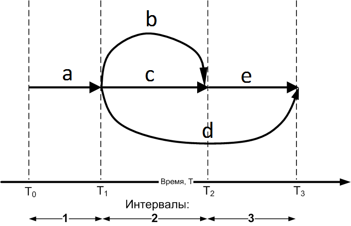

Программа, реализующая указанную на графе последовательность запуска потоков, должна запустить 5 потоков: *a*, *b*, *c*, *d* и *e*. Работу программы можно разбить на три временных интервала:
1. С момента времени T0 до T1 работает только поток *a*.
2. С T1 до T2 параллельно работают потоки *b*, *c* и *d*.
3. С T2 до T3 параллельно работают потоки *d* и *e*.

## Сборка и тестирование
Для сборки кода рекомендуется создать проект в любой IDE, например, Visual Studio, CLion, Code::Blocks или аналогичной. Работоспособность тестов гарантируется при использовании компилятора VC11 (входит в Visual Studio 2012) или более позднего и компилятора GCC в составе пакета MinGW 5.0 или более позднего.

Рекомендуется локально запускать тесты несколько раз даже в случае их успешного выполнения, поскольку последовательность выполнения потоков может отличаться от запуска к запуску программы и ошибка в решении задачи синхронизации потоков может проявляться не всегда. Если тесты пройдены успешно, можно выполнить команды `git add lab3.cpp`, `git commit` и `git push`, после чего убедиться, что тесты также успешно пройдены и в репозитории.

## Содержание отчета
- Титульный лист 
- Цель работы
- Задание на лабораторную работу
- Граф запуска потоков
- Результат выполнения работы
- Исходный код программы с комментариями
- Выводы

## Варианты графов запуска потоков

| Номер варианта  | Граф запуска потоков |
| --- | --- |
| 1   | 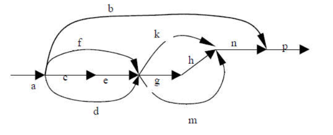  |
| 2   |   |
| 3   | 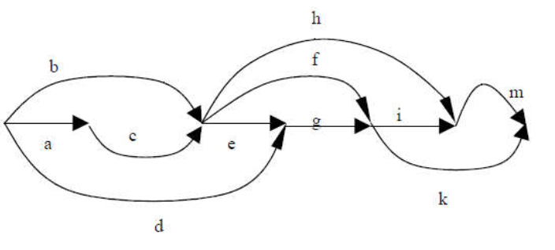  |
| 4   |   |
| 5   | 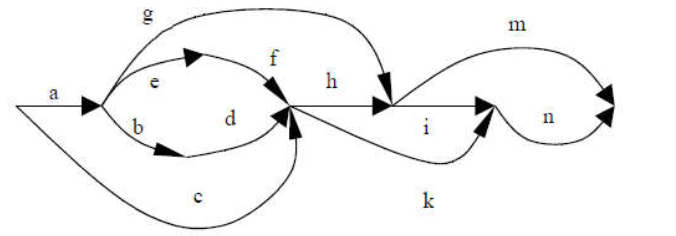  |
| 6   | 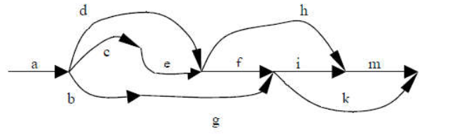  |
| 7   | 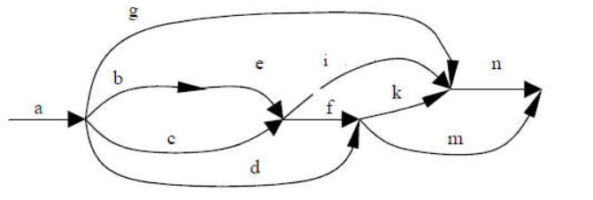  |
| 8   | 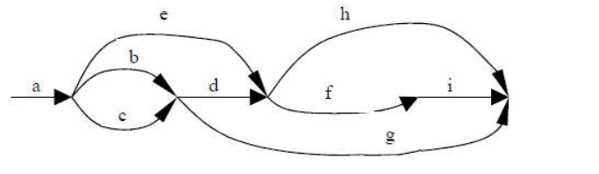  |
| 9   | 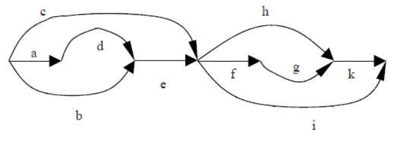  |
| 10  | 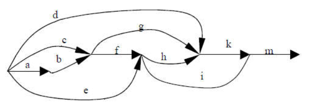  |
| 11  | 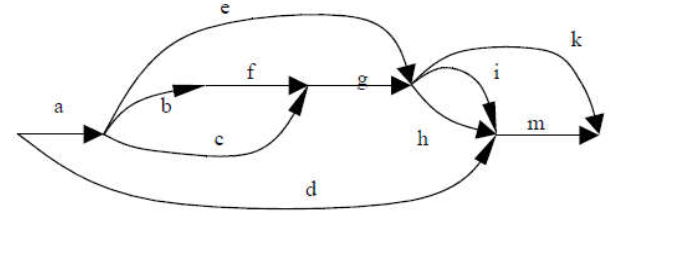  |
| 12  | 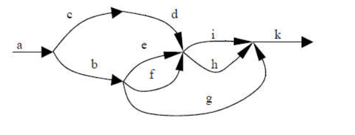  |
| 13  | 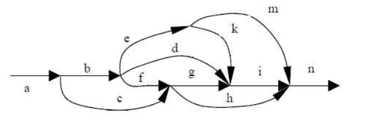  |
| 14  | 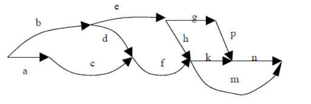  |
| 15  | 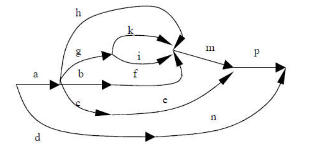  |
| 16  | 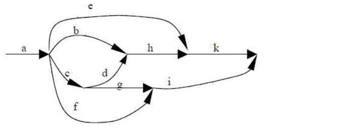  |
| 17  | 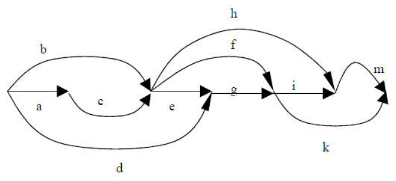  |
| 18  | 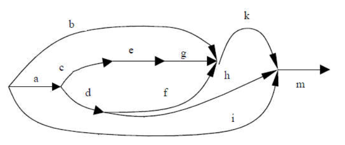  |
| 19  | 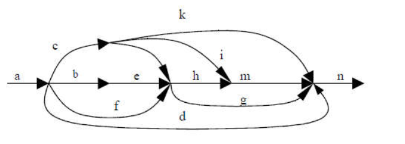  |
| 20  | 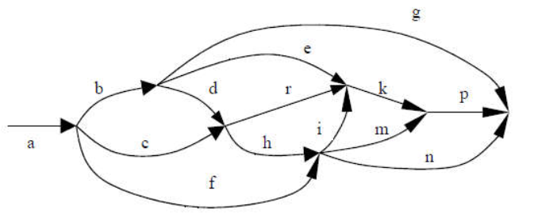  |

## Вопросы
Электронный адрес для связи: m.polyak [собачка] guap [точка] ru
